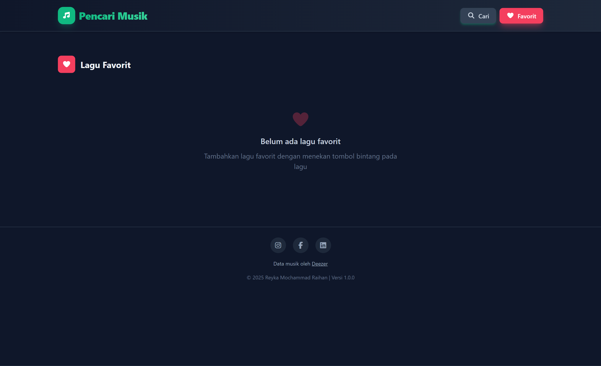
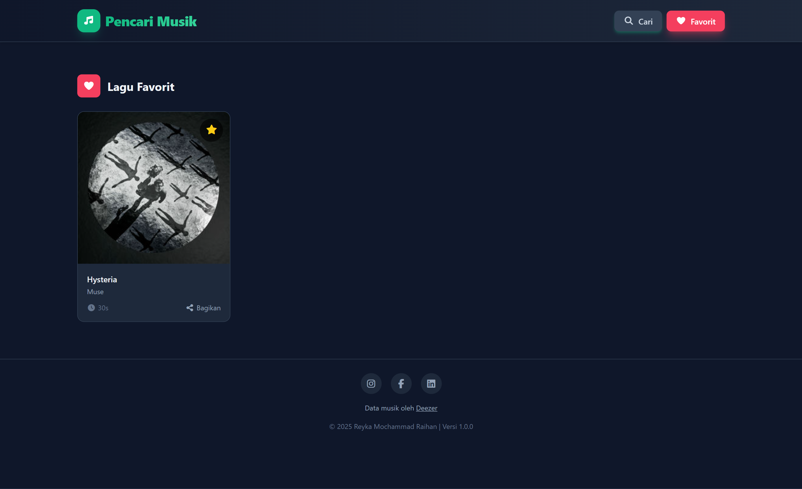

# 🎵 Aplikasi Pencarian Musik


Aplikasi web sederhana yang memungkinkan pengguna mencari dan memutar preview lagu (30 detik) dari Deezer. Dibangun menggunakan Tailwind CSS, jQuery 3.7, dan Deezer API (JSONP).

---

## 📸 Tampilan Aplikasi
<table>
  <tr>
    <td></td>
    <td></td>
    <td></td>
    <td></td>
  </tr>
</table>

---

## ✨ Fitur Utama
- 🔍 **Pencarian Lagu** - Cari lagu, artis, atau album menggunakan Deezer API.
- 📈 **Top Chart** - Menampilkan lagu populer dari Deezer saat aplikasi dibuka.
- 🎶 **Mini Player** - Play, pause, next, previous, progress bar, dan tampilan cover.
- ⭐ **Favorit** - Simpan/hapus lagu favorit di localStorage.
- 🕒 **Riwayat Pencarian** - Riwayat otomatis (maks 10 item) dengan opsi hapus.
- 📤 **Bagikan** - Salin link Deezer ke clipboard.
- ⚡ **Skeleton Loader & Loading Overlay** - Indikator loading dan UX. 

---

## 🛠 Teknologi yang Digunakan
- **HTML5**
- **Tailwind CSS**
- **JavaScript (jQuery 3.7)**
- **Font Awesome**
- **[Deezer API (JSONP)](https://developers.deezer.com/login?redirect=/api)**

---

## 🚀 Instalasi
1. Clone repositori:
   ```bash
   git clone https://github.com/ReykaMR/pencari-musik.git
   cd pencari-musik
2. Buka file index.html di browser favorit.

---

🧭 Cara Pakai
1. Ketik kata kunci (judul, artis, atau album) di kotak pencarian.
2. Tekan tombol Cari atau Enter.
3. Klik Putar pada kartu lagu untuk mendengarkan preview.
4. Gunakan ikon bintang untuk menambah/menghapus favorit.
5. Buka tab Favorit untuk melihat lagu yang disimpan.

---

🔐 Catatan & Batasan
- Deezer menyediakan preview singkat (biasanya 30 detik), bukan lagu penuh.
- JSONP digunakan untuk menghindari pembatasan CORS. Jika Deezer mengubah API, aplikasi perlu disesuaikan.
- Jalankan lewat server lokal bila mengalami masalah saat membuka file://.
